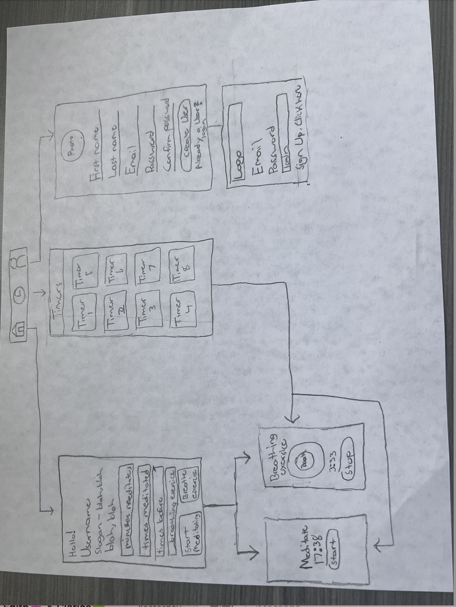
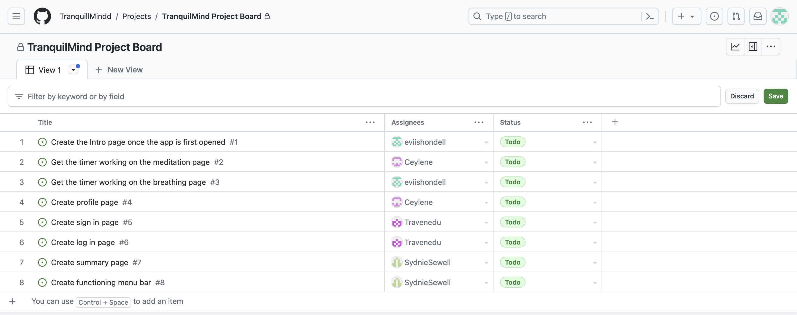
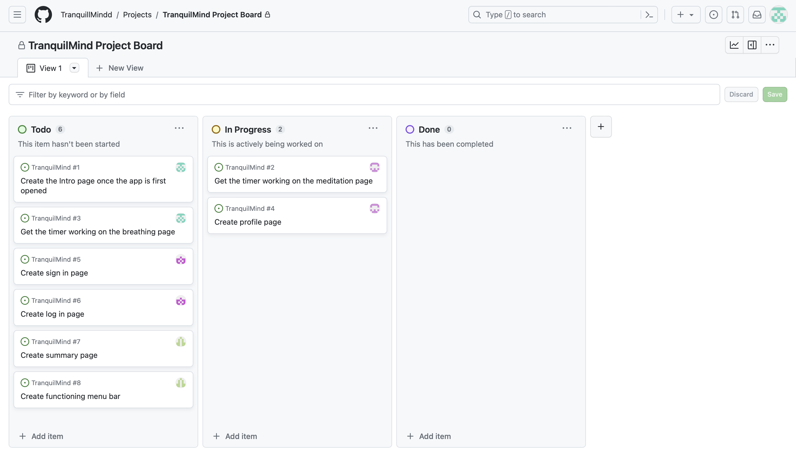

# Milestone 1 - TranqilMind

## Table of Contents

1. [Overview](#Overview)
1. [Product Spec](#Product-Spec)
1. [Wireframes](#Wireframes)

## Overview

### Description

TranquilMind is the perfect companion for those looking to embark on a journey of inner peace and relaxation, especially if you're new to meditation and mindfulness practices. This Meditation and Relaxation App has been thoughtfully designed to help you find serenity and mindfulness in the fast-paced world we live in.

### App Evaluation
- **Category:** Health and Wellness
- **Mobile:** This app can offer a unique mobile experience in ways such as follows:
   - Accessibility: Mobile apps make relaxation and meditation practices accessible anytime, anywhere. Users can take a few moments to meditate during a busy day, whether they're at home, at work, or on the go.
   - Personalization: Apps can use data and user input to personalize the meditation experience. For example, they can adapt meditation recommendations based on a user's stress levels or progress over time.
   - Customization: Mobile apps can tailor meditation sessions to individual user preferences. Users can select the type of meditation (e.g., mindfulness, sleep, stress relief), duration, and even the background music or sounds that suit their mood and environment.
- **Story:** This app is extremely valuable for my peers and friends as it will provide an escape for my peers currently experiencing intense stress from academic pressures.
- **Market:** Anyone with a smartphone who is currently struggling to find a healthy release from the stress of their daily life.
- **Habit:** This app can be used daily by its users to check in regularly to maintain calmness.
- **Scope:** This app will allow user to access multiple calming exercises.The scope for this application is well-defined, encompassing features such as a user-friendly interface, an extensive database of interactive calming exercises and personalized recommendations. 

## Product Spec

### 1. User Features (Required and Optional)

**Required Features**

1. User must be able to use Meditation Timer.
2. User must be able to use Breathing Exercise Timer.
3. User must be able to see Welcome Page when launching the app.

**Optional Features**

1. Login page
2. User Profile

### 2. Screen Archetypes

- Welcome Page
  - Slogan
  - Image
- Timer Page
    - Timers with titles
- Profile Page
    - User details

### 3. Navigation

**Tab Navigation** (Tab to Screen)

* Home
* Timers
* Profile

**Flow Navigation** (Screen to Screen)

- Timer
    - Breathing Timer
    - Meditation Timer
- Welcome Page
  - Profile Page
- Profile Page
    - Home Page

## Wireframes

 

 

# Milestone 2 - Build Sprint 1 (Unit 8)

## GitHub Project board

## Issue cards

- 
- [Add screenshot of your Project Board with the issues that you're working on in the **NEXT sprint**. It should include issues for next unit with assigned owners.] 

## Issues worked on this sprint

- List the issues you completed this sprint
- [Add giphy that shows current build progress for Milestone 2. Note: We will be looking for progression of work between Milestone 2 and 3. Make sure your giphys are not duplicated and clearly show the change from Sprint 1 to 2.]

 

# Milestone 3 - Build Sprint 2 (Unit 9)

## GitHub Project board

[Add screenshot of your Project Board with the updated status of issues for Milestone 3. Note that these should include the updated issues you worked on for this sprint and not be a duplicate of Milestone 2 Project board.] 

## Completed user stories

- List the completed user stories from this unit
- List any pending user stories / any user stories you decided to cut
from the original requirements

## App Demo Video

- Embed the YouTube/Vimeo link of your Completed Demo Day prep video
